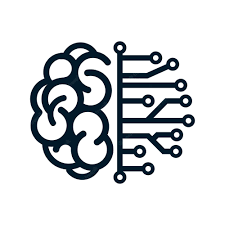

## College Backstory

Software engineering is a broad field that encompasses a variety of concepts, and while it’s hard to pick, there are some topics that interest me more than others. To explain my interests, a little background is necessary. When I was a sophomore as an electrical engineer, I was still very unsure of what I wanted to do. I chose electrical engineering on a whim and I realized I didn’t care for classes such as circuit analysis as much compared to my coding classes. While I was debating about switching to computer engineering, I joined my sophomore project as a member of the Micro VIP lab. In this lab, my team was in charge of training neural networks to measure the size and growth rate of various components of embryos and use this to grade its quality for in vitro fertilization, or IVF. During this time, I became heavily interested in machine learning and that became a large part of my choice in switching to computer engineering. 

## Present in SCEL

In line with this, I hope to develop my skills in machine learning and use these skills for the betterment of society, hopefully in the field of renewable energy. Currently, I am in the SCEL lab, which works with weatherboxes to take meteorological data and use this data to forecast the best possible placements for photovoltaics, or solar panels. While I am currently in the firmware team, which helps with the collection and storage of the data that we collect, I hope to join the machine learning team next semester, which researches various machine learning algorithms to be able to predict where the most solar irradiance will occur.

## Future Goals

In the future, I hope that by developing my skills in machine learning and related fields, I am able to help develop the future of renewable energy technology. With AI, we can learn to optimize renewable energy sources as well as accelerate our transition to using 100% clean energy. Overall, I want my skills and knowledge in software engineering to help create a more sustainable future for everyone.

