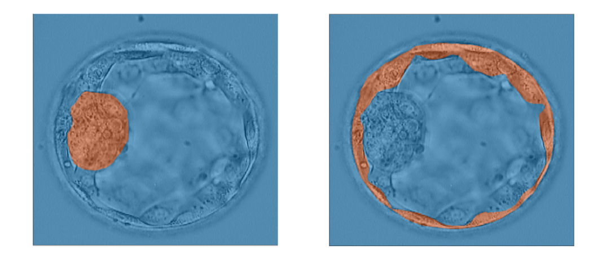

The goal of my team was to train a neural network to accurately measure the sizes and growth rates of the trophectoderm epithelium (TE) and inner cell mass (ICM) of embryos in order to grade them for in-vitro fertilization. By doing this, we could simplify the process of IVF and make it easier for embryologists to accurately score embryos. Our team was able to achieve a fairly high accuracy and Jaccard Index, training the neural network to have an average accuracy of 95%.

As sophomores new to the project, me and my teammates were in charge of labelling the images of embryos given to us by embryologists. We later augmented those images so that we could train the neural networks with more images, and develop a more accurate network. We developed code for a brightness augmentation that changes the brightness of the images so the network could be trained with images of various brightness levels. Other augmentations done by previous members were mixed with the brightness augmentation and our job was to find a combination of augmentations that yielded the highest accuracy. I also worked on the graphical user interface (GUI) that displayed the results of the neural network. This GUI used the Tkinter library of Python.

By doing this project, I learned how to work in a team of engineers, which is very different from doing homework and tests individually. This new challenge helped me grow as an engineer, and I was also able to greatly improve my skills in Python coding, gain an understanding of neural networks, and learn how to augment data sets to train these networks.

Below is an example of the grading of the embryos we did with neural networks:

