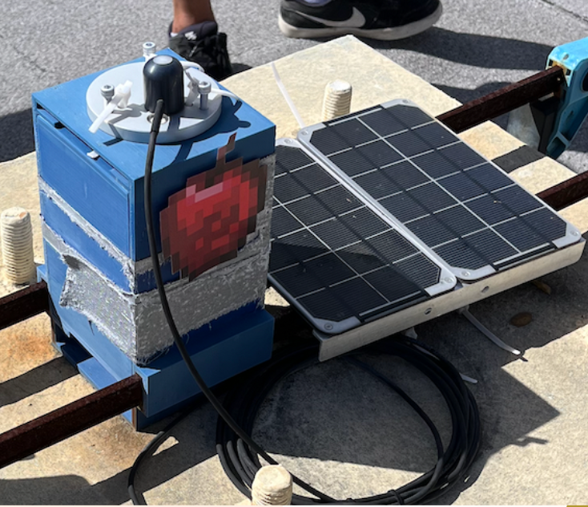

My team's goal was the development and maintenance of the code utilized by the weatherboxes to acquire data from their diverse sensors and transmit it back to the laboratory. To achieve this, we chose to implement a streamlined data pipeline, which would standardize the data transmission process across the various weatherboxes deployed by our hardware teams. Our current goal is to create a website for our hardware team's to have easy access to their data sets.

I was with this lab last semester for my junior project and I am currently with SCEL for my senior capstone engineering project. Being on the firmware team has taught me a variety of software engineering related skills, such as using SQL to help develop a database to store the meteorological data from our weatherboxes. I also improved my proficiency with Python by helping maintain and update firmware code to make sure our weatherboxes were transmitting data efficiently and correctly. Here's an example of one of our weatherboxes that we're planning to deploy soon for context:

The SCEL GitHub: <a href="https://github.com/scel-hawaii/control-tower"><i class="large github icon "></i>https://github.com/scel-hawaii/control-tower</a>
